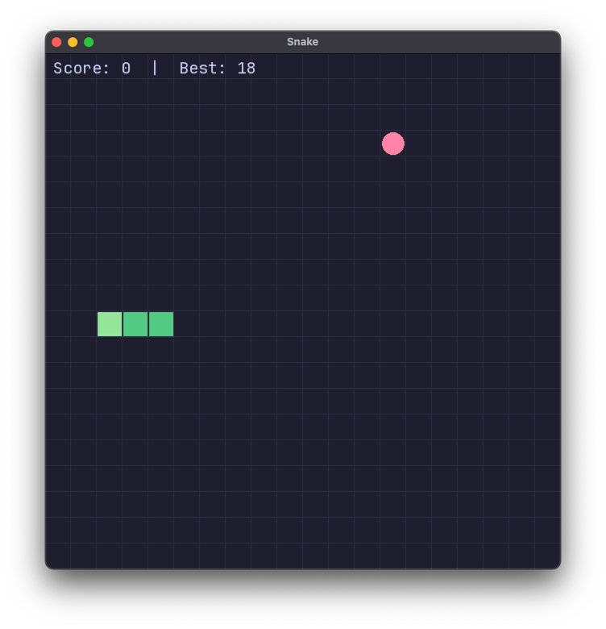

# Snake

Classic snake game built with C++23 and SFML 3.



## Build & Run

```bash
make build   # configure + compile
make run     # build + launch
make test    # build + run 16 unit tests
make clean   # remove build artifacts
```

## Code Quality

```bash
make format        # auto-format with clang-format
make format-check  # verify formatting (CI)
make lint          # static analysis with clang-tidy
make coverage      # test coverage report (requires LLVM)
```

## Requirements

- CMake 3.25+
- C++23 compiler (Clang 17+ / GCC 14+)
- SFML 3.0.2 and Catch2 v3.7.1 (fetched automatically)
